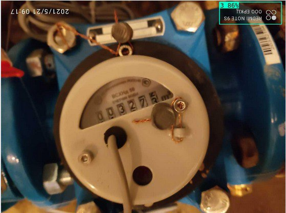
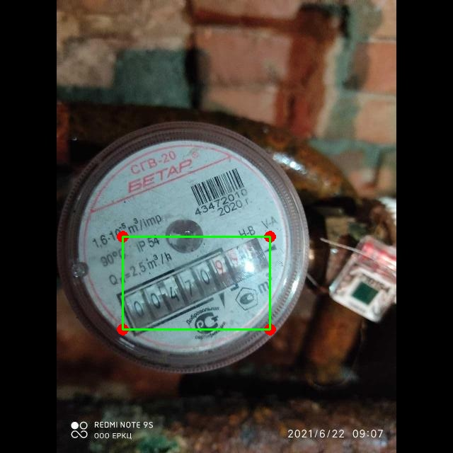
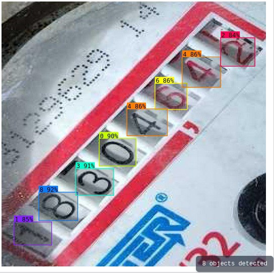

Я использую модель Yolov5 для обучения и решения задачи распознавания показаний счетчика.

## Определить ориентацию изображения
После просмотра всех данных я не вижу предоставленного файла `**task.csv**`. Я использую `Roboflow`, чтобы определить текущую ориентацию изображения и повернуть его вперед. Например, фотография ниже отмечена цифрой `3`, что означает, что мне нужно повернуть ее на `180 градусов`, чтобы вернуть фотографию на передний план, что облегчит распознавание цифр, отображаемых на счетчике.

## Определите площадь по цифрам на счетчике
Поскольку предоставленные данные не помечены, я использовал существующий набор данных `Roboflow`, аналогичный тому, который необходим для обучения и распознавания области отображения счетчика. Вырежьте эту область и поместите ее в другую цифровую модель идентификации.

## Определите отображаемые цифры
Числа идентифицируются, располагаются по оси `Ox` и получаются результаты.

